## Exercício 1

CREATE TABLE Actor (
    id VARCHAR(255) PRIMARY KEY,
    name VARCHAR (255) NOT NULL,
    salary FLOAT NOT NULL,
    birth_date DATE NOT NULL,
    gender VARCHAR(6) NOT NULL
);

a) Os demais comandos que estão na query são:

- CREATE TABLE Actor => utilizado para criar uma tabela com o nome Actor
- id/ name VARCHAR(255) => torna possível criar uma string com no máximo 255 caracteres para o id e o name
- PRIMARY KEY => Chave primária (chave única na tabela)
- birth_date DATE => significa que a birth_date deverá ser criada respeitando o formato YYYY-MM-DD
- gender VARCHAR(6) => o parâmetro gender será criado no formato string de no máximo 6 caracteres
- NOT NULL => indica que a coluna não pode ser nula. Precisa ter algum valor

b) Comando SHOW DATABASES: retornou dua linhas (rows). Uma chamada 'information_schema' e outra chamada 'jbl-4415982-rafael-lopes'.
E para o comando SHOW TABLES: retornou a table Actor.

c) DESCRIBES retorna o tipo de dados configurado em cada campo
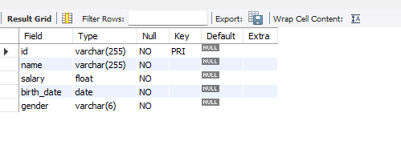

## Exercício 2

a) Escreva uma query que crie a atriz Glória Pires, com o id 002, salário R$1.200.000 e data de nascimento 23 de Agosto de 1963
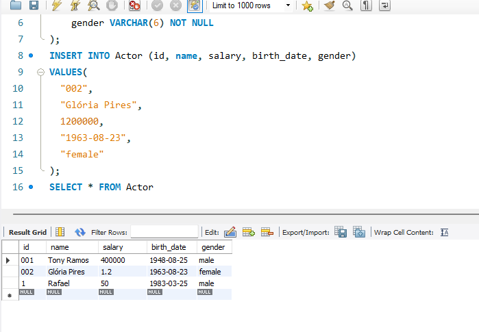

b) Retornou um erro de entrada duplicada em razão de já existir um item com chave única na tabela

c) Retornou um error code 1136: Column count doesn’t match value count at row 1 -> significa que o número de informações que foi inserido na tabela não corresponde ao número de colunas da tabela. Neste caso foi inserido mais informações do que o número de colunas da tabela. Para corrigir o problema foi adicionado os parâmetros birth_date e gender para que os valores correspondam com o número de colunas, conforme pode ser visto na imagem abaixo.

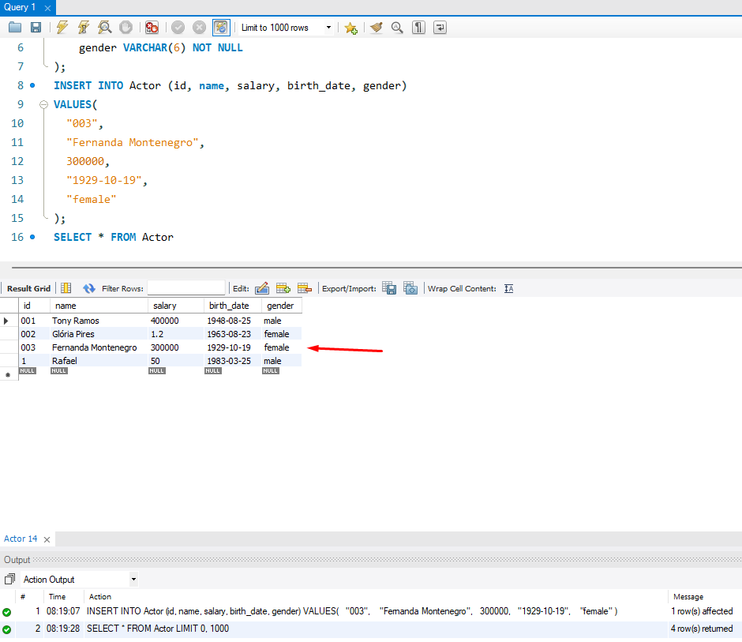

d) Retornou um error code 1364: Field 'name' doesn't have a default value -> significa que a coluna name não recebeu um valor. Este erro ocorre porque o valor para name está NOT NULL, o que exige que um valor seja inserido nessa coluna para resolver o erro.  Para corrigir o problema foi adicionado o parâmetro name, fazendo com que dessa vez os dados do autor seja inserido na tabela.

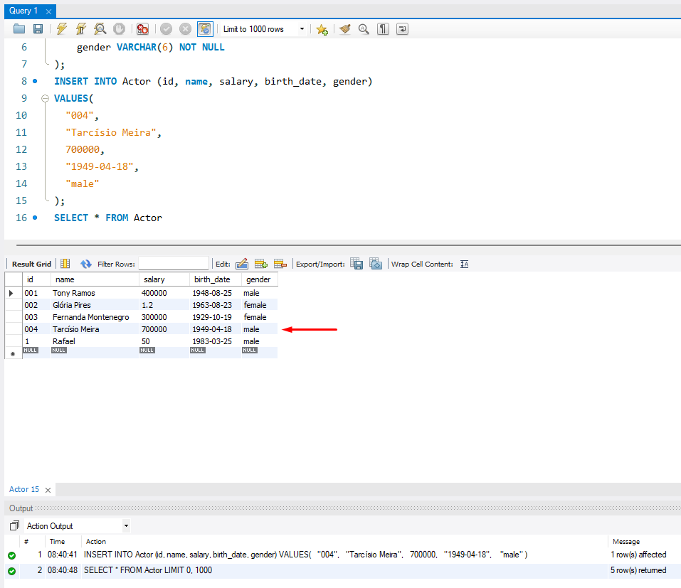

e) Retornou um error Code: 1292: Incorrect date value: '1950' for column 'birth_date' at row 1. Isso porque o formato da data de nascimento inserido não corresponde ao formato padrão. Para resolver o problema foi adicionado aspas duplas em volta do nome da atriz Juliana Paes.

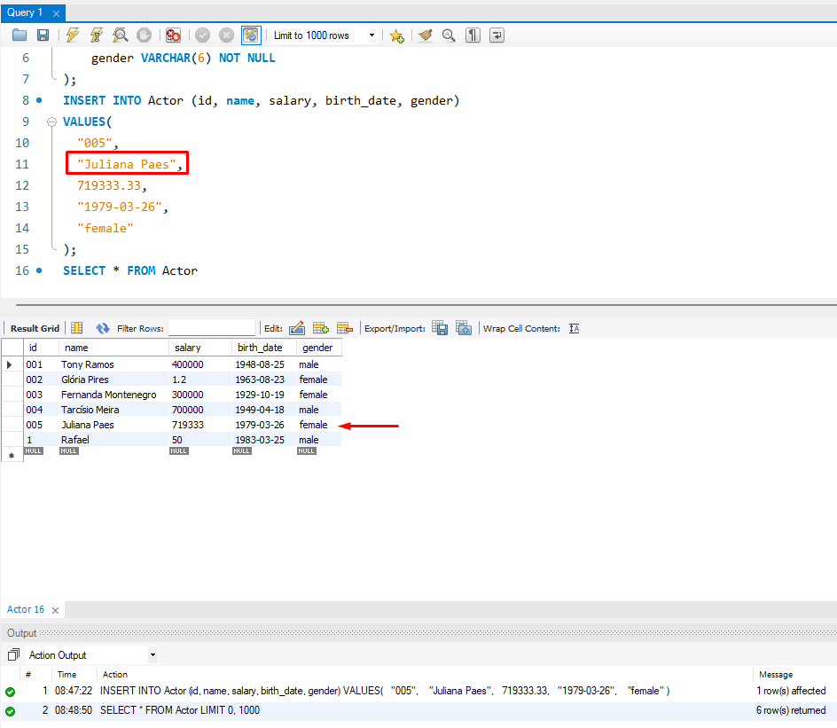

f) Adicionei os atores Rodrigo Santoro e Paola Oliveira.

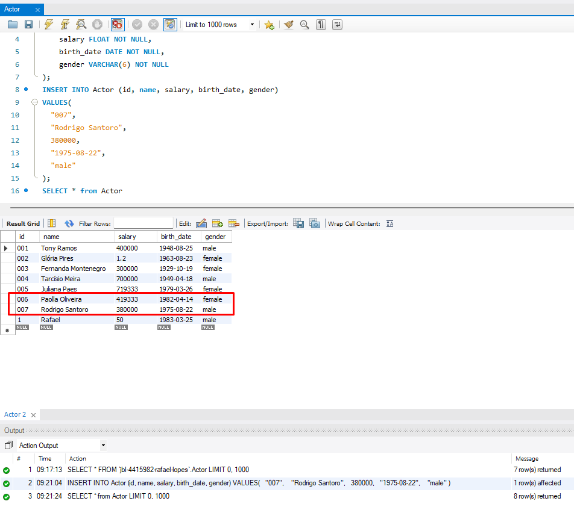

## Exercício 3

a) Escreva uma query que retorne todas as informações das atrizes.

R: SELECT * from Actor WHERE gender = "female"

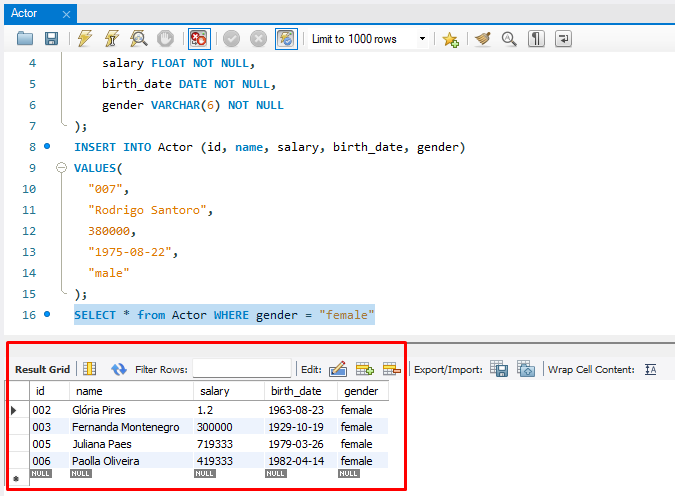

b) Escreva uma query que retorne o salário do ator com o nome Tony Ramos

R: SELECT name, salary from Actor WHERE name = "Tony Ramos"

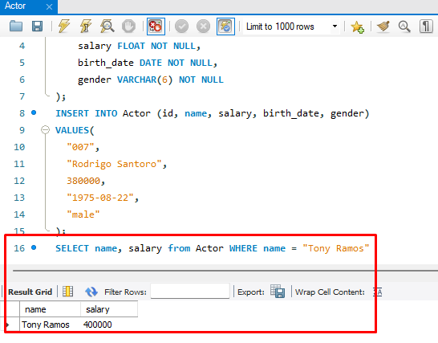

c) Escreva uma query que retorne todas as informações que tenham o gender com o valor "invalid". Explique o resultado.

R: SELECT gender from Actor WHERE gender = "invalid". Retornou a coluna gender com row = 0.

d) Escreva uma query que retorne o id, nome e salário de todos que tenham o salário com o valor máximo de R$500.000

R: SELECT id, name, salary from Actor WHERE salary < 500001

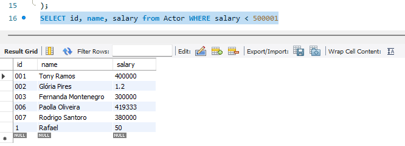

e) Gerou um error Code: 1054. Unknown column 'nome' in 'field list'. A coluna 'nome' não foi encontrada. Corrigi nome para name que é a opção existente na tabela.

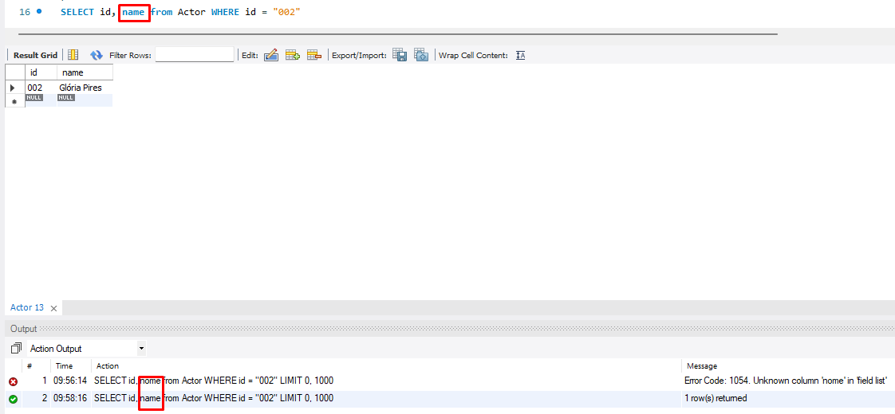

## Exercício 4

a) SELECT * FROM Actor WHERE (name LIKE "A%" OR name LIKE "J%") AND salary > 300000

R: A query acima solicita que retorne todos atores que possuem o nome que comece com a letra A ou J e com o salário maior que 300 mil.

b) Escreva uma query com os atores que não comecem com a letra "A" e tenham o salário maior do que R$350.000,00

R: SELECT name, salary from Actor WHERE name NOT LIKE "A%" AND salary > 350000

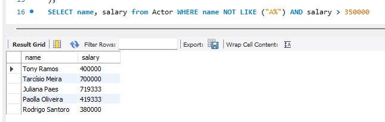

c) Escreva uma query com os atores que possuam "G" ou "g" em qualquer parte do nome.

R: SELECT name from Actor WHERE name LIKE "G%" OR name LIKE "g%"

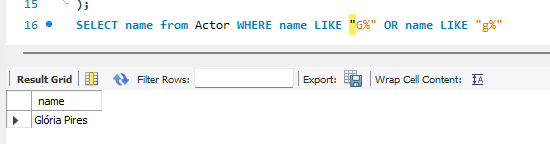

d) Escreva uma query com os atores que tenham a letra "a" ou "A" ou "g" ou "G" no nome e o salário entre R$350.000,00 e R$900.000,00

R: SELECT * FROM Actor WHERE (name LIKE "%a%" OR name LIKE "%A%" OR name LIKE "%g%" OR name LIKE "%G%") AND salary BETWEEN 350000 AND 900000;

# Exercício 5

a) Explique a query resumidadmente

CREATE TABLE Filmes(
id VARCHAR(255) PRIMARY KEY,
nome VARCHAR(255) NOT NULL,
sinopse TEXT NOT NULL,
data_de_lancamento DATE NOT NULL,
avaliacao INT NOT NULL
);

- CREATE TABLE Filmes => Cria uma entidade (tabela) com o nome Filmes
- id VARCHAR(255) PRIMARY KEY => torna possível criar uma chave primária como id com no máximo 255 caracteres
- nome VARCHAR(255) NOT NULL => indica que a coluna não pode ser nula. Precisa ter algum valor e nome do título não pode ultrapassar os 255 caracteres de espaço reservado
- sinopse TEXT(10000) NOT NULL, => este parametro será obrigatório e do tipo texto sem limitação de caracteres 
- data_de_lancamento DATE NOT NULL, => a data de lançamento deverá ser criada respeitando o formato YYYY-MM-DD e esse dado será obrigatório
- avaliacao INT NOT NULL => o parametro avaliação é obrigatória e receberá um número inteiro

b) INSERT INTO Filmes (id, nome, sinopse, data_de_lancamento, avaliacao)
VALUES(
"001",
"Se Eu Fosse Você",
"Cláudio e Helena são casados há muitos anos e enfrentam a rotina do casamento. Um dia eles são atingidos por um fenômeno inexplicável e trocam de corpos",
"2006-01-06",
7
);