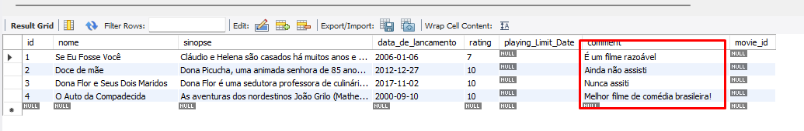

# Exercícios de aprofundamento Relações SQL

## Exercício 1

a) Uma chave estrangeira é um identificador exclusivo ou uma combinação de identificadores exclusivos que conectam duas ou mais tabelas em um banco de dados. Em outras palavras, é uma referência em uma tabela a uma chave primária de outra tabela.

b) Crie a tabela e, ao menos, uma avaliação para cada um dos filmes

c) Tente criar uma avaliação para um filme que não existe (ou seja, um id inválido). Anote e explique o resultado da query.

d) ALTER TABLE Rating DROP rating => apaga a coluna chamada rating.

e) Tente apagar um filme que possua avaliações. Anote e explique o resultado da query.

R: Haviam 4 rows, retornou 3

